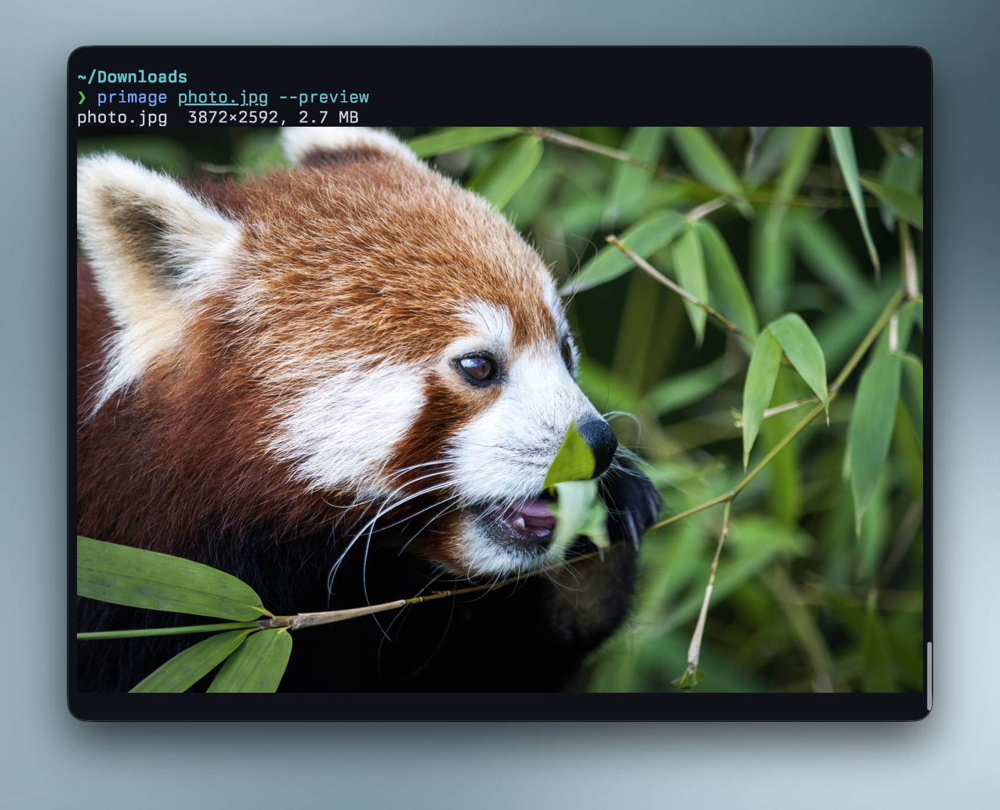

# primage

[](https://crates.io/crates/primage)
[](https://github.com/imfing/primage/releases/latest)
[](https://github.com/imfing/primage/actions/workflows/ci.yml)
[](https://crates.io/crates/primage)
[](https://github.com/imfing/primage/blob/main/LICENSE)

A fast native CLI for compressing, converting and resizing images. Think of it
as the common [Squoosh](https://github.com/GoogleChromeLabs/squoosh) workflows,
available from your terminal and scriptable across whole batches of images.

- Encode JPEG with MozJPEG, optimized PNG with OxiPNG, lossy or lossless WebP,
  AVIF with ravif/rav1e, and QOI.
- Honor EXIF orientation, then resize, constrain dimensions or rotate.
- Process batches in parallel across CPU cores.
- Preview images at native terminal pixel resolution with the Kitty graphics
  protocol on supported Unix terminals.
- Use self-contained release binaries with codec libraries compiled in.

```console
$ primage photo.png -f avif
photo.png → photo.avif  3.3 MB → 44.0 KB  (-98.7%)
```

## Installation

```sh
# Homebrew (macOS and Linux)
brew install --cask imfing/tap/primage

# Cargo (macOS, Linux and Windows)
cargo install primage --locked
```

Prebuilt binaries for macOS, Linux and Windows are available from the
[latest GitHub release](https://github.com/imfing/primage/releases/latest).

## Common workflows

| Goal | Command |
|---|---|
| Compress a JPEG with MozJPEG | `primage photo.jpg -q 75` |
| Convert to MozJPEG and resize | `primage hero.png -f jpeg -q 82 --max-size 1920 -o hero.jpg` |
| Resize to an exact width | `primage photo.jpg --resize 1200x -q 75 -o photo-1200.jpg` |
| Bulk compress photos | `primage *.jpg --max-size 2400 -q 75 -o optimized/` |
| Bulk convert PNG to WebP | `primage *.png -f webp -q 75 -o webp/` |
| Convert to lossless WebP | `primage image.png -f webp --lossless -o image.webp` |
| Convert to AVIF | `primage hero.png -f avif -q 50 --avif-speed 6 -o hero.avif` |
| Optimize a PNG | `primage screenshot.png --png-level 6` |
| Rotate and resize | `primage portrait.jpg --rotate 90 --max-size 1600 -q 80 -o portrait-fixed.jpg` |
| Show processing details and timings | `primage photo.jpg -q 75 -vv` |
| Preview in the terminal | `primage --preview photo.jpg` |
| Preview the compressed result | `primage photo.jpg -q 40 --preview` |

## Command reference

```console
primage [OPTIONS] <INPUT>...

-o, --output <PATH>        Output file, or directory when processing multiple inputs
-f, --format <FORMAT>      jpeg | png | webp | avif | qoi   (default: same as input)
-q, --quality <1-100>      Lossy quality (defaults: jpeg=75, webp=75, avif=50)
    --lossless             Lossless WebP compression
    --resize <GEOMETRY>    WxH, Wx (auto height), xH (auto width)
    --max-size <PX>        Shrink so the longest side is at most PX (minimum: 1)
    --rotate <90|180|270>  Rotate before encoding
    --resize-filter <F>    Resampling: triangle | catrom | gaussian | lanczos3 | nearest
    --png-level <0-6>      OxiPNG effort (default: 2)
    --png-interlace        Adam7 interlacing
    --avif-speed <0-10>    AVIF encoder speed (default: 6)
-s, --suffix <SUFFIX>      Suffix for generated names, e.g. -s .min
    --overwrite            Allow overwriting an existing output file
    --preview              Display the image in the terminal (Kitty protocol)
-v, --verbose...           Show processing details; repeat for stage timings
```

Input decoding supports JPEG, PNG, WebP, GIF, TIFF, BMP, ICO, TGA, PNM and QOI
through an 8-bit RGBA pipeline. EXIF orientation is applied before requested
rotation and resizing. Use `-v` for processing details or `-vv` to include
decode, transform, encode and write timings.

Without `-o`, naming collisions append a number to the full stem:
`photo.jpg` becomes `photo1.jpg`, and `photo.min.jpg` becomes
`photo.min1.jpg`. An explicit `-o FILE` errors if it already exists unless
`--overwrite` is set.

## Terminal previews



On Unix, `--preview` renders images inline via the
[Kitty graphics protocol](https://sw.kovidgoyal.net/kitty/graphics-protocol/).
It works in Ghostty, kitty, WezTerm and Konsole.

- Preview-only mode decodes the input, applies transforms and displays it
  without writing a file.
- Combining `--preview` with encoder options decodes and displays the bytes
  that were actually written, so lossy compression artifacts are visible.
- Preview detection is disabled when stdout is not a TTY, keeping pipes clean.
- The terminal must report its screen dimensions in pixels so primage can
  prepare a native-resolution image without terminal-side resampling.

Encoded AVIF previews are not available because AVIF decoding is not included.
The AVIF is still written and primage prints a warning instead of displaying a
misleading pre-encoding preview.

## Codecs

| Format | Backend | Defaults |
|---|---|---|
| JPEG | [`mozjpeg`](https://crates.io/crates/mozjpeg) | q75, progressive, optimized Huffman coding, automatic 4:2:0/4:4:4 chroma subsampling |
| PNG | [`oxipng`](https://crates.io/crates/oxipng) | effort level 2, optional Adam7 interlacing |
| WebP | libwebp via the [`webp`](https://crates.io/crates/webp) crate | q75 lossy (method 4), or `--lossless` |
| AVIF | [`ravif`](https://crates.io/crates/ravif) with rav1e | q50, speed 6 |
| QOI | [`image`](https://crates.io/crates/image) crate | lossless |

### Cargo features

| Feature | Default | Codec backend |
|---|---|---|
| `mozjpeg` | yes | MozJPEG, statically linked. Disabled: pure-Rust baseline JPEG. |
| `libwebp` | yes | Lossy WebP through libwebp, statically linked. Disabled: pure-Rust lossless WebP only. |
| `avif` | yes | AVIF through ravif/rav1e. Disable for a substantially faster source build. |

Build from a checkout with a custom feature set:

```sh
cargo build --release --no-default-features --features avif
```

Not supported yet: JPEG XL (no mature pure-Rust encoder;
[`jxl-oxide`](https://crates.io/crates/jxl-oxide) is decode-only) and palette
quantization. HEIC/HEIF input decoding is desirable, but currently blocked on a
license-compatible, cross-platform backend; HEIC encoding is not planned
because of HEVC licensing concerns.

## Portability

Release binaries are self-contained: MozJPEG, libwebp and OxiPNG's bundled
libdeflate are compiled in, so an archive can be copied to another machine with
the same operating system and architecture without installing codec libraries.

## Roadmap

- [ ] JPEG XL decoding through `jxl-oxide`
- [ ] AVIF decoding when a suitable pure-Rust decoder matures
- [ ] Palette quantization through `imagequant`
- [ ] SIMD resizing through `fast_image_resize`

## License

[Apache License 2.0](LICENSE).
